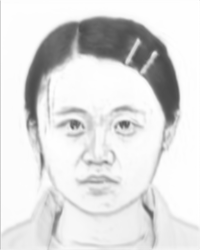

# Face Sketch Synthesis with Style Transfer using Pyramid Column Feature

## Introduction

This is a project to do face sketch synthesis. Here is an example
<p align="center">
  
  
  
</p>

## Getting Started

### Prerequisite
- Python 2.7
- keras 0.3.3
- Theano 0.8.2
- CUDA 7.5      
- CUDNN 5.0

It should be easy to install the python package with Anaconda and `pip install`.  
**Please make sure you have all the right version packages, or the code may not run properly.**

### Usage

The following command line arguments is needed to run the demo
- test image path
- save content image path
- save sketch result path
- component weights: style weight, content weight, region weight

And the following arguments is optional

- facepath, path to the train face photo
- sketchpath, path to the train sketch. (NOTE: the corresponding sketch and photo must have the same name)
- vggweight, path to gray version of vgg16
- contentweight, path to weight of content network
- featpath, path to precomputed train photo feature. (This may take large disk space, make sure you have enough space[>8GB] for it under this path)

example usage:
```
KERAS_BACKEND=theano python sketch_generate.py ./test/1.png ./result/content.png ./result/sketch.png 1. 0.001 0.1 
```

NOTE: the gpu number can be set by `THEANO_FLAGS=device=gpu0`

To generate results for all images in `test/`, run the following script
```
KERAS_BACKEND=theano python generate_result.py
```

### Train the Content Network

Optional arguments
- face_path, train photo path
- sketch_path, train sketch path
- save_weight_dir, path to save the weight
- resume, whether resume the last train
- batch_size, mini batch size

example usage:
```
KERAS_BACKEND=theano python train_content_net.py
```
